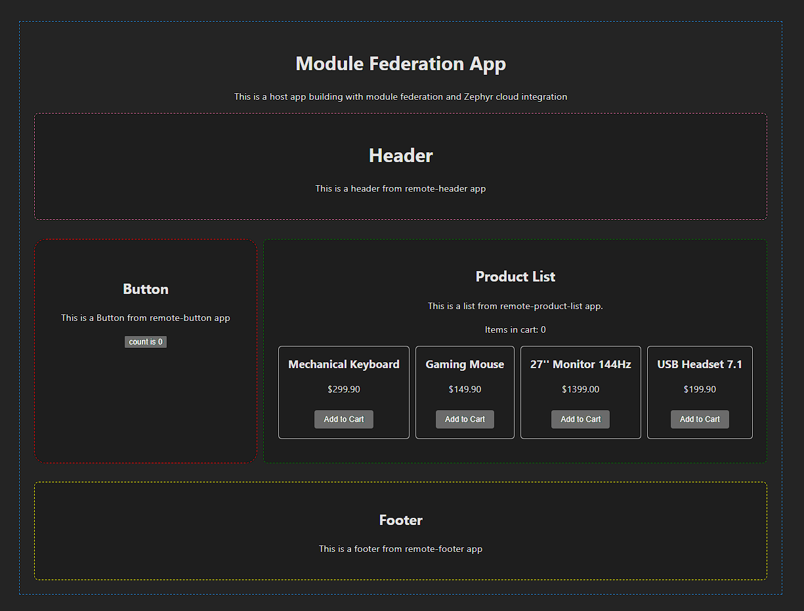

# React Micro-Frontend Example

A comprehensive micro-frontend setup demonstrating Module Federation with multiple bundlers working together.



## Solo app links

- Footer: https://matheus-castegnaro-35-vite-remote-footer-zephyr-m-7d59111ff-ze.zephyrcloud.app/
- Header: https://matheus-castegnaro-36-vite-remote-header-zephyr-m-debe6f696-ze.zephyrcloud.app/
- Product List: https://matheus-castegnaro-37-vite-remote-product-list-ze-da9637db1-ze.zephyrcloud.app/
- Button: https://matheus-castegnaro-38-vite-remote-button-zephyr-m-f843f6dd4-ze.zephyrcloud.app/

## Complete application link

- host: https://matheus-castegnaro-40-vite-host-zephyr-mf-app-mca-b8d54f0f6-ze.zephyrcloud.app/

## Technology Stack

- **Framework**: React 18
- **Architecture**: Module Federation
- **Host Application**: Vite
- **Remote Applications**:
  - Vite Remote Host (TypeScript)
  - Vite Remote Button (TypeScript)
  - Vite Remote Footer (TypeScript)
  - Vite Remote Product List(TypeScript)
  - Vite Remote Header (TypeScript)
- **Deployment**: Zephyr Cloud

## Prerequisites

- Node.js (version 16 or higher)
- pnpm (required for workspace management)

## Project Structure

This example consists of multiple applications:

- **`host/`** - Main host application built with Vite
- **`remote-button/`** - Remote application built with Vite
- **`remote-footer/`** - Remote application built with Vite
- **`remote-header/`** - Remote application built with Vite
- **`remote-product-list/`** - Remote application built with Vite

## Getting Started

1. **Install dependencies**

   ```bash
   pnpm install
   ```

2. **Build all applications** (in order)

   ```bash
   pnpm --filter=vite_remote_footer build
   pnpm --filter=vite_remote_header build
   pnpm --filter=vite_remote_product_list build
   pnpm --filter=vite_remote_remote build
   pnpm --filter=vite-host build
   ```

   Or use the convenience script:

   ```bash
   pnpm build
   ```

3. **Development mode**
   Each application can be run independently:

   ```bash
   # Host application (port 5175)
   cd host && pnpm dev

   # Remote applications
   cd remote-footer && pnpm dev    # port 5171
   cd remote-header && pnpm dev    # port 5172
   cd remote-product-list && pnpm dev    # port 5173
   cd remote-button && pnpm dev    # port 5174
   ```

   **Development URLs:**

   - **Host**: http://localhost:5175
   - **Vite remote-footer**: http://localhost:5171
   - **Vite remote-header**: http://localhost:5172
   - **Vite remote-product-list**: http://localhost:5173
   - **Vite remote-button**: http://localhost:5174

## Zephyr Cloud Integration

This example demonstrates advanced micro-frontend deployment with Zephyr Cloud, showing how different bundlers can work together seamlessly in a federated architecture.

## About Module Federation

Module Federation allows multiple JavaScript applications to share components and dependencies at runtime. This example shows:

- **Multi-bundler compatibility**: Different remotes using different bundlers
- **Runtime composition**: Components loaded dynamically at runtime
- **Independent deployment**: Each remote can be deployed separately

## About Zephyr Cloud

Zephyr Cloud is a micro-frontend deployment platform that provides:

- **Auto-deployment**: Seamless deployment from your build process
- **Live preview links**: Instant preview URLs for your applications
- **SemVer versioning**: Semantic versioning for your frontend modules
- **Rollback capabilities**: Easy rollback to previous versions
- **Enterprise-scale orchestration**: Built for composable frontend systems

## Learn More

- [Module Federation Documentation](https://module-federation.io/)
- [Vite Documentation](https://vitejs.dev/)
- [Rspack Documentation](https://rspack.dev/)
- [Webpack Documentation](https://webpack.js.org/)
- [Zephyr Cloud Module Federation Guide](https://docs.zephyr-cloud.io/recipes/vite-rspack-webpack-mf)
